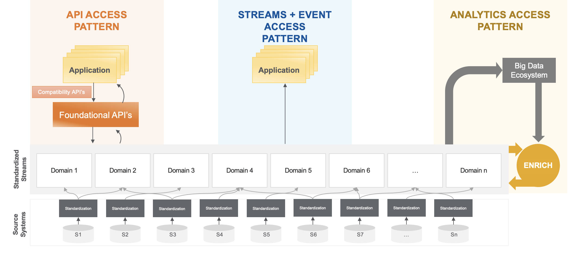
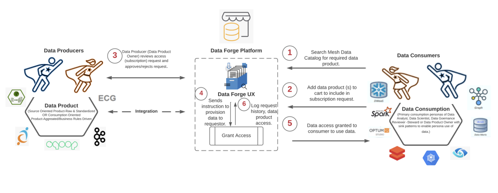
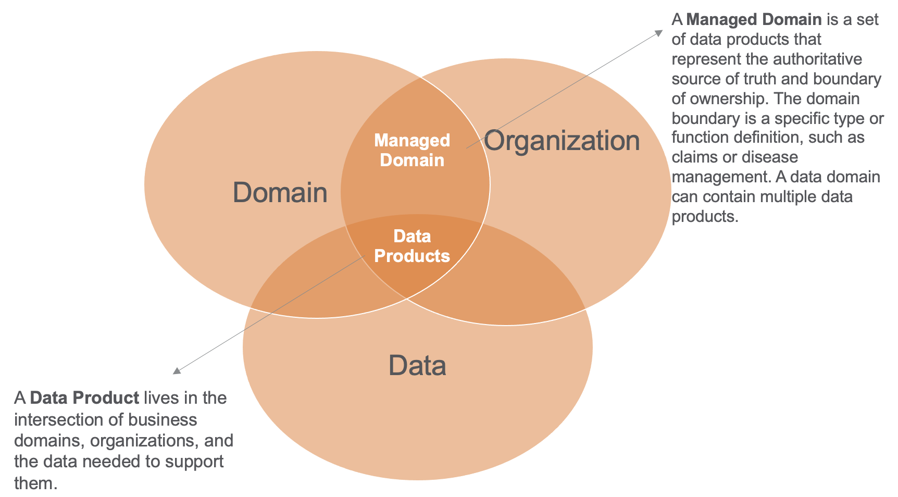

At Optum we believe healthcare data is one of the most powerful tools that can drive innovate clinical solutions and improve patient experience. We work with petabyte scale data sets to do work on some of healthcare’s more impactful problems, such as predictive analytics, end of end patient views for individuals, and robust digital health platforms that allow care anytime from anywhere.

Historically one of the biggest challenges we have faced is around data access, governance, standardization, and movement. Accessing datasets securely and quickly is on the biggest drivers of unlocking engineering teams. At Optum we are in the middle of a transformative transition from centralized data and data ownership to a decentralized model based on principles from Data Mesh. By moving to a decentralized data ownership and governance model, teams are encouraged to expose quality datasets in a secure, auditable, and discoverable manner via Optum’s implementation of Data Mesh.

This post is the first of a 4-part blog and describes our evolution towards Data Mesh as well as our experience leveraging and extending a popular open-source metadata platform, [DataHub](https://datahubproject.io/). In follow up blog posts we will expand on our usage of DataHub and go into depth on

- How we have extended the metadata model within DataHub
- Building custom metadata ingestion plugins to populate our data mesh
- Building event-based triggers to act on real time on metadata changes

## History: Healthcare Data Platform – Standard Streams & APIs

Our initial iteration on healthcare platform largely revolved around 3 access patterns – standard APIs, standardized data streams and a common big data ecosystem. Data was to be sourced from one of the three above patterns and no direct access to data was discouraged.

This largely manifested technically with a change data capture process reading transaction logs on data bases and emitting events to Apache Kafka. Those records were then denormalized under a given key and joined together to build the standardized output Kafka topic. The standardized Kafka topic was then stored in modern data platforms such as Elastic and Cassandra which were then queried to serve API traffic.

This pattern proved successful for most use cases. However, a downside was that this approach relied heavily on a set of standardized schemas, which were difficult to identify across lines of business with the vast scope within Optum. Governance to determine schemas and access to data grew in difficultly and complexity as the platform expanded. Because everyone had slightly different use cases, this occasionally meant teams still needing access to the source data rather than the standardized version.

## Now: Data Forge, Data Mesh & DataHub

Today, Optum is taking a data mesh approach to data governance, access, discovery, and use.

Our current iteration of data platform is one that connects data producers and consumers across the enterprise, utilizing their preferred patterns. Data Mesh provides a new way of thinking about data at Optum. It is a fundamental shift away from aggregating data in a single lake or database and trying to centralize data governance. By enabling data mesh, we enable governance and ownership are approached in a decentralized pattern. This allows the stewards who know their data, access requirements and restrictions to make decisions on what data is exposed and who can access it.

Data Forge focuses on three personas to drive adoption of Data Mesh:

1. **Producers**: Data Producers can create data products from 1 or more data sets which involves adding additional metadata aspects. These additions have proven to increase discoverability and provide necessary context around data products. This encourages quality datasets and incentivize data products to expose the most up to date and accurate data sets.
2. **Consumers**: Data Consumers can discover and subscribe to a data product via the Data Forge UI. Data is quickly discovered and understood, and engineering and analytics teams at Optum realize faster time to value through streamlined access review and provisioning. Additionally, Data Forge provides a built-in data movement capability to move data to and from various platforms depending on use case (more info [here](https://opensource.optum.com/blog/2022/01/25/data-streaming-at-scale-with-benthos)).
3. **Stewards**: Stewards ensure appropriate data access and usage that aligns to security, privacy, and contractual policies. Typically, stewards can approve or deny data subscriptions to grant access to data products.

We leverage the idea of data products internally - which vary from data sets. Each of the three personas plays a unique role in the creation, usage, and governance of data products. Data products require additional metadata around the data and encourage usage of preferred data sets (more up to date, more accurate, etc.).

### Datahub

Data Forge is built on top of Linkedin's DataHub and extends it with various metadata model enhancements and aspects.

Data Forge heavily leverages Datahub, a modern open-source metadata platform originally from Linkedin. [This documentation](https://datahubproject.io/docs/architecture/architecture) provides an architectural overview. Datahub has provided us an excellent base from which to build on Data Mesh, and leverage much of its functionality out of box, such as its ingestion framework, search capabilities, and built-in metadata aspects.

#### Extendibility

One of the main benefits we have leveraged from DataHub is its extensibility. We can easily use low code methods to extend the metadata model to add various aspects (pieces of metadata) as well as top level entities (think datasets, pipelines, and machine learning models). This allows us to extend to support internal representations of data and add additional business specific context as necessary.

We also have built plugin extensions to support custom internal platforms to ingest metadata. This was a significant upgrade over many metadata platforms previously used that weren't as extendable and could only support ingestion via out of box platforms.

Finally, DataHub’s event driven architecture provides us a mechanism to act on any metadata changes in real time. This allows us to perform various actions like provisioning access to a data product, notifying consumers on any schema changes that may affect their application or triggering data movement jobs to move data from source to sink platforms.

Out engineering team will elaborate on these in more detail in future posts with specific tutorials and walk throughs!

#### Community

The DataHub community is active and growing and we are excited to continue to invest in it. The community has significant say on its roadmap and the core maintainers have been extremely supportive of our use cases. We are thrilled to be listed as adopters on [DataHub's official documentation site](https://datahubproject.io/).

The community has made it seamless to begin contributing back to DataHub. As a result, we have begun contributing fixes and enhancements back to upstream. Examples of upstream contributions include support for TLS when connecting to Schema Registry from the metadata service and various enhancements to the Snowflake ingestion plugin.

Community support is available in the [DataHub Slack](https://datahubproject.io/docs/slack/) channel. The community is active and growing rapidly. It has provided our team a fantastic way to have influence on road map, collaborate with the community and get exposure to how others are managing data in a timely manner.
